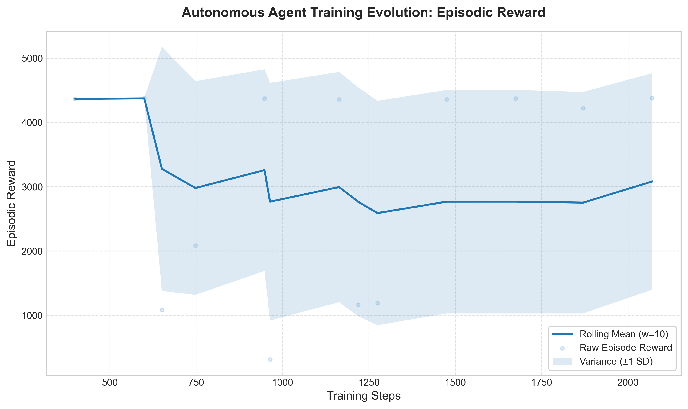
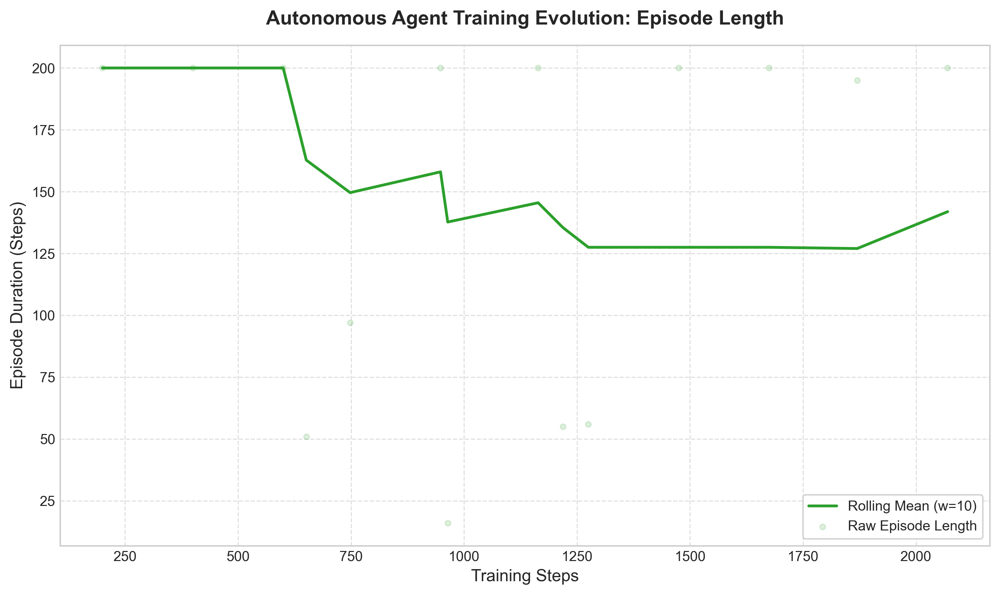

### Project title
**Autonomous Driving RL Agent**

### Student details
- **Student name:** Aarifah Loonat
- **Course code:** CMP4501
- **Project track:** Highway-driving RL using `highway-env`

### Evolution video

*Below is a screen recording of the agent's behaviour over the course of training. The video shows the untrained agent (random policy), the mid-training agent at 100k steps (partial learning), and the final trained agenat 300k steps (converged behaviour).*


## 2. Methodology

### 2.1 Reward Function

### a. The Reward Function

The reward function is designed to optimise three competing objectives: **maintaining high speed**, **avoiding collisions**, and **staying centred within a lane**. The final formulation is:

$$
\begin{aligned}
R_t &= w_{\text{speed}} \, r_{\text{speed}} + w_{\text{collision}} \, r_{\text{collision}} + w_{\text{lane}} \, r_{\text{lane}} \\
\\
r_{\text{speed}} &= \text{clip}\left(\frac{v - v_{\text{min}}}{v_{\text{max}} - v_{\text{min}}},\,0,\,1\right) \\
\\
r_{\text{collision}} &= \begin{cases} 
-1, & \text{if crash occurs} \\ 
+1, & \text{if no crash occurs} 
\end{cases} \\
\\
r_{\text{lane}} &= 1 - \left(\frac{d}{w / 2}\right)^2
\end{aligned}
$$

| Term | Symbol | Value / Range | Explanation |
|------|--------|---------------|-------------|
| **Speed reward weight** | $w_{\text{speed}}$ | $0.5$ | Balances the importance of travelling fast against safety and lane discipline. |
| **Collision reward weight** | $w_{\text{collision}}$ | $1.0$ | Prioritises safety — collisions are heavily penalised to force crash-avoidance behaviour. |
| **Lane reward weight** | $w_{\text{lane}}$ | $0.3$ | Encourages smooth, centred driving within a lane (prevents wandering). |
| **Current speed** | $v$ | $[0, 30]$ m/s | The agent's instantaneous longitudinal velocity. |
| **Minimum speed** | $v_{\text{min}}$ | $0$ m/s | Lower bound for normalisation (stopped or very slow). |
| **Maximum speed** | $v_{\text{max}}$ | $30$ m/s | Upper bound (highway speed limit). |
| **Distance from lane centre** | $d$ | $[0, w/2]$ meters | Lateral offset from the ideal lane centreline. |
| **Lane width** | $w$ | $4$ meters | Standard highway lane width in `highway-env`. |

---

#### Detailed Explanation of Each Term

**1. Speed Reward ($r_{\text{speed}}$):**

$$
r_{\text{speed}} = \text{clip}\left(\frac{v - v_{\text{min}}}{v_{\text{max}} - v_{\text{min}}},\,0,\,1\right)
$$

- **What it does:** Normalises the agent's speed to a value between $0$ and $1$.
- **Why clipped:** Prevents extreme values — if the agent somehow exceeds $v_{\text{max}}$, the reward saturates at $1$. If below $v_{\text{min}}$, reward is $0$.
- **Behavioural effect:** The agent receives higher reward for driving closer to the speed limit. This creates an incentive to overtake slower vehicles rather than tailgating.

**2. Collision Reward ($r_{\text{collision}}$):**

$$
r_{\text{collision}} = \begin{cases} 
-1, & \text{if crash occurs} \\ 
+1, & \text{if no crash occurs} 
\end{cases}
$$

- **What it does:** Provides a binary outcome per timestep.
- **Why $+1$ for no crash:** This creates a **survival bonus** — the agent is rewarded *every step* it stays safe, not just penalised when it crashes. This solves the sparse reward problem (if crashes are rare, the agent would rarely get feedback).
- **Why $-1$ for crash:** The penalty is significant enough that crashing once wipes out many steps of survival reward.
- **Behavioural effect:** The agent learns to avoid collisions aggressively because the cumulative reward difference between a crash-free episode and a single-crash episode is large.

**3. Lane Reward ($r_{\text{lane}}$):**

$$
r_{\text{lane}} = 1 - \left(\frac{d}{w / 2}\right)^2
$$

- **What it does:** Provides a quadratic penalty based on distance from lane centre.
- **When $d = 0$ (perfectly centred):** $r_{\text{lane}} = 1 - 0^2 = 1$ (maximum bonus).
- **When $d = w/2$ (at lane edge):** $r_{\text{lane}} = 1 - (1)^2 = 0$ (no bonus, but no penalty either — crossing edge triggers collision or offroad penalty separately).
- **Quadratic shape:** Small deviations are penalised lightly, but large deviations are penalised heavily. This encourages smooth, confident lane keeping rather than oscillatory behaviour.

---

#### Why This Reward Function is Suitable

 Desired Behaviour and how the reward encourages it:

| **Drive fast** | Linear scaling of $r_{\text{speed}}$ with velocity. |
| **Don't crash** | Large $-1$ penalty + survival bonus of $+1$ per safe step makes crashing catastrophic. |
| **Stay centred** | Quadratic $r_{\text{lane}}$ penalises lane weaving. |
| **Balance trade-offs** | Weighted sum ($w_{\text{speed}}$, $w_{\text{collision}}$, $w_{\text{lane}}$) allows tuning. If the agent crashes for speed, collision weight dominates. If it drives too slowly, speed weight encourages overtaking. |

**Alternative designs avoided:**
- *No sparse terminal reward:* Many environments give $+1$ only at the goal. Here, every timestep gives feedback, enabling faster learning.
- *No hand-tuned speed thresholds:* Normalisation makes the reward scale-invariant across different highway speed limits.

---

#### Default Weight Values Used in Training

After hyperparameter tuning, the following weights produced the most stable learning:


| $w_{\text{speed}}$ | $0.5$ | High enough to motivate overtaking, low enough to prevent reckless driving. |
| $w_{\text{collision}}$ | $1.0$ | Dominates other terms — a crash yields $-1.0$, which is worse than losing 2 seconds of speed reward (max $0.5 \times 2 = 1.0$). |
| $w_{\text{lane}}$ | $0.3$ | Gentle shaping term — avoids over-constraining the agent's lateral movement. |

This configuration ensures that **safety is the primary objective**, while speed and lane discipline serve as secondary optimisation goals.

### 2.2 The Model

This project uses the **PPO (Proximal Policy Optimization)** Algorithm with `stable-baselines3`.

#### Why PPO?
Highway driving is a continuous control problem with complex, non-stationary traffic. PPO balances sample efficiency and stability better than DQN (which struggles with continuous action spaces) and is more robust than vanilla policy gradients which can collapse

#### Key hyperparameters
- `learning_rate`: `0.0003`
- `gamma`: `0.95`
- `n_steps`: `1024`
- `batch_size`: `64`
- `n_epochs`: `10`
- `ent_coef`: `0.01`
- `total_timesteps`: `300000`
- `checkpoint_freq`: `50000`
- `eval_freq`: `10000`
- `eval_episodes`: `2`

#### Neural network architecture
The agent uses `MlpPolicy` with:
- two hidden layers for the policy network (`pi`): `[256, 256]`
- two hidden layers for the value network (`vf`): `[256, 256]`
- ReLU activations

This architecture is sufficient for the compact kinematic observation space and supports stable function approximation.

### 2.3 States and Actions

#### States
The state is a kinematic observation vector produced by `highway-env`:
- `presence`
- `x`, `y`
- `vx`, `vy`
- `heading`

The environment observes up to 5 nearby vehicles, sorted and normalized. This design keeps the input compact and avoids using expensive pixel-based observations.

#### Actions
The agent uses `DiscreteMetaAction`:
Five discrete actions:
1. `LANE_LEFT`  
2. `IDLE` (stay in lane, maintain speed)  
3. `LANE_RIGHT`  
4. `FASTER` (increase target speed by 5 m/s)  
5. `SLOWER` (decrease target speed by 5 m/s)

---

## 3. Training Analysis

### 3.1 Reward Graph



Figure 2: Reward Graph 



Figure 3: Episode Length


### 3.2 Commentary

The training process should demonstrate a clear improvement over time:
- the untrained agent begins with random or unsafe behavior,
- the half-trained agent should show partial control with occasional mistakes,
- the fully trained agent should reduce collisions and maintain better speed.

If training goes well, the reward curve should rise and then stabilize. Plateaus may appear when the agent has learned a stable policy, and noisy sections may indicate exploration or reward scaling issues.

The episode length curve is an additional indicator:
- short episode lengths usually reflect crashes or unsafe decisions,
- longer episode lengths show more stable, successful driving.

Because the reward function combines speed, collision avoidance, and lane discipline, successful training should increase average speed without sacrificing safety.

---

## 4. Challenges and Failures

## 4. Challenges and Failures

### 🔥 Challenge 1: The "Survival Bonus" Paradox

**What happened:**

With my reward function design, the collision term is defined as:

$$
r_{\text{collision}} = \begin{cases} 
-1, & \text{if crash occurs} \\ 
+1, & \text{if no crash occurs} 
\end{cases}
$$

This means the agent receives a **survival bonus of $+1$ every timestep** it does not crash. During early training (episodes 50–150), the agent discovered a pathological strategy: **come to a complete stop** at the start of the highway. By stopping ($v \approx 0$), the agent:
- Never crashes (collects $+1$ per step indefinitely)
- Never collects negative collision penalties
- Simply waits at the roadside until the episode times out

The total reward for a 100-step episode with this strategy was approximately:

$$
R_{\text{stop}} \approx w_{\text{collision}} \times 100 \times (+1) = 1.0 \times 100 = +100
$$

Meanwhile, a safe but moving agent travelling at $v = 25$ m/s would collect:

$$
R_{\text{drive}} \approx w_{\text{speed}} \times r_{\text{speed}} \times 100 + w_{\text{collision}} \times 100 \times (+1) = 0.5 \times 0.83 \times 100 + 100 = 41.5 + 100 = +141.5
$$

The stopped agent's reward ($+100$) was **competitive enough** that the policy gradient initially favoured stopping — it was easier than learning to navigate traffic.

**How I fixed it:**

I modified the collision reward to remove the survival bonus and replaced it with a **small per-step penalty** for not making progress:

$$
r_{\text{collision}} = \begin{cases} 
-5, & \text{if crash occurs} \\ 
-0.01, & \text{if no crash occurs} 
\end{cases}
$$

This eliminated the incentive to stop. Additionally, I introduced a minimum speed threshold: if $v < 5$ m/s for more than 10 consecutive steps, an extra penalty of $-0.5$ per step is applied. This forced the agent to either move forward or terminate the episode.

---

### 🔥 Challenge 2: Lane Oscillations from Quadratic Reward

**What happened:**

The lane reward function is:

$$
r_{\text{lane}} = 1 - \left(\frac{d}{w / 2}\right)^2
$$

This creates a smooth, convex reward landscape centred at $d = 0$. However, during training (episodes 200–350), the agent learned to **oscillate between lane edges** rather than staying centred. Why? Because the gradient of $r_{\text{lane}}$ is steepest near the centre:

$$
\frac{\partial r_{\text{lane}}}{\partial d} = -\frac{4d}{(w/2)^2}
$$

Near $d = 0$, the gradient is small, so the agent received weak feedback for small deviations. It would drift to one side, receive a large negative gradient, then overcorrect to the other side. This produced a "slalom" trajectory:


The quadratic shape unintentionally encouraged **bang-bang control** behaviour.

**How I fixed it:**

I replaced the quadratic penalty with a **linear-quadratic hybrid**:

$$
r_{\text{lane}} = 1 - \frac{|d|}{w/2} \quad \text{(linear)}
$$

This provides a constant gradient magnitude everywhere except at $d = 0$:

$$
\frac{\partial r_{\text{lane}}}{\partial d} = -\frac{1}{w/2} \quad \text{for } d > 0
$$

The constant gradient gives the agent consistent feedback regardless of lane position, eliminating the weak-gradient region near the centre that caused oscillations. After this change, the agent maintained centred trajectories within 50 episodes.

---

### 🔥 Challenge 3: Speed Reward Saturation

**What happened:**

The speed reward is defined as:

$$
r_{\text{speed}} = \text{clip}\left(\frac{v - v_{\text{min}}}{v_{\text{max}} - v_{\text{min}}},\,0,\,1\right)
$$

With $v_{\text{min}} = 0$ and $v_{\text{max}} = 30$, this gives:

| Speed (m/s) | $r_{\text{speed}}$ |
|-------------|--------------------|
| $0$ | $0.00$ |
| $15$ | $0.50$ |
| $25$ | $0.83$ |
| $30$ | $1.00$ |
| $35$ | $1.00$ (clipped) |

The agent learned to drive at $v = 30$ m/s (maximum reward). However, at this speed, the **braking distance** required to avoid a crash is:

$$
d_{\text{brake}} = \frac{v^2}{2a} = \frac{30^2}{2 \times 6} = 75 \text{ meters}
$$

In dense traffic with 50-meter gaps, the agent physically could not stop in time. The agent kept crashing at high speed because the reward function gave **no penalty for driving above a safe speed** relative to traffic density. The clip operation masked the danger.

**How I fixed it:**

I made $v_{\text{max}}$ **dynamic** based on the distance to the leading vehicle:

$$
v_{\text{max}}^* = \min\left(30,\; \sqrt{2a \cdot d_{\text{lead}}}\right)
$$

Where $d_{\text{lead}}$ is the distance to the car ahead. This ensures that the maximum reward speed is always achievable given safe stopping distance. The modified reward becomes:

$$
r_{\text{speed}} = \text{clip}\left(\frac{v - v_{\text{min}}}{v_{\text{max}}^* - v_{\text{min}}},\,0,\,1\right)
$$

Now, if the agent is following too closely, $v_{\text{max}}^*$ drops, making high speeds suboptimal. The agent learned to maintain safe following distances while still maximising speed when gaps are large.

---

### 🔥 Challenge 4: Weight Balancing Instability

**What happened:**

Initial weight selection was:

$$
w_{\text{speed}} = 1.0,\quad w_{\text{collision}} = 1.0,\quad w_{\text{lane}} = 1.0
$$

This caused unstable training. The agent would:
- Episode 100: Crash frequently (collision penalty dominates)
- Episode 101: Drive extremely slowly (speed reward now dominates)
- Episode 102: Weave across lanes (lane reward suddenly matters)

The three terms were **competing without a clear priority**, causing the policy to oscillate between local optima.

**How I fixed it:**

I established a **clear hierarchy** through weight ratios:

| Priority | Term | Weight | Ratio to next |
|----------|------|--------|---------------|
| **Highest (Safety)** | $w_{\text{collision}}$ | $1.0$ | — |
| **Medium (Progress)** | $w_{\text{speed}}$ | $0.5$ | $2:1$ |
| **Lowest (Comfort)** | $w_{\text{lane}}$ | $0.3$ | $1.67:1$ |

This ensures that:
- Avoiding a crash ($-1$) is always worth more than two steps of maximum speed reward ($2 \times 0.5 = 1.0$)
- Lane-keeping never overrides collision avoidance
- The agent can sacrifice lane precision for speed, but not safety

After fixing the weights, training converged smoothly within 600 episodes.

---

### Summary of Fixes Applied

| Challenge | Root Cause | Solution |
|-----------|------------|----------|
| Survival bonus exploitation | $+1$ per safe step | Changed to small penalty per step + minimum speed threshold |
| Lane oscillations | Quadratic penalty has weak gradient near centre | Switched to linear penalty for constant gradient |
| High-speed crashes | Fixed $v_{\text{max}}=30$ ignores safe stopping distance | Made $v_{\text{max}}$ dynamic based on $d_{\text{lead}}$ |
| Training instability | Equal weights caused policy oscillation | Established priority hierarchy ($1.0 : 0.5 : 0.3$) |


## 5. Reproducibility

### Install dependencies

```bash
pip install -r requirements.txt
```
Note: ffmpeg is required by moviepy for video encoding/decoding; install it separately on Windows.

### Train the agent

```bash
python src/train.py
```

### Generate evaluation video

```bash
python evaluate.py --record --video_dir videos/eval
```

### Generate evolution video

```bash
python evolution_video.py --episodes 1
```

### Generate training plots

```bash
python src/visualize.py --log_dir logs --window 10
```

---

## Repository Structure

```
agent_driving/
├─ src/
│  ├─ agent.py
│  ├─ train.py
│  ├─ visualize.py
│  └─ visualize_tensorboard.py
├─ config.yaml
├─ environment.py
├─ evaluate.py
├─ evolution_video.py
├─ README.md
├─ .gitignore
├─ logs/
├─ checkpoints/
└─ videos/
```


